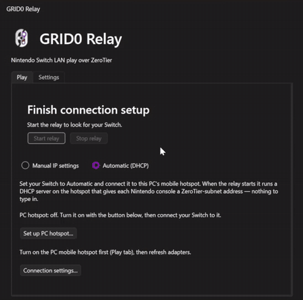
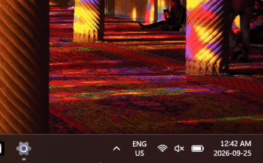
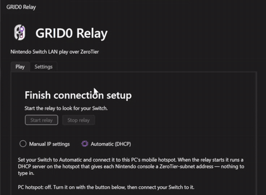

# GRID0 ofw

**Play Switch games online with friends over a virtual LAN. 
Original Firm-Ware (ofw) build for stock Switch 1 and 2, for Unmodded Switch Users.**

Replaces the old LAN-play relays with better stability, faster speeds, and an easier setup. 
Works for cross-play with banned switch users and emulator users. Fork of switch-lan-play, runs on ZeroTier. More info at [GRID0](https://github.com/GRID0-net/GRID0).

## Setup Guide

Stock consoles cannot execute background custom modules. `GRID0-ofw` runs on a PC connected to the same home network, capturing and translating LAN-Play packets automatically.

1. Download the latest release from the **[releases page](https://github.com/GRID0-net/GRID0-ofw/releases)** and open `GRID0-ofw`.
2. `GRID0-ofw` will automatically install ZeroTier One and npcap.
   <small>

For certainty:
Make sure they are installed (it should say ZeroTier One and npcap are installed in the `GRID0-ofw` settings). 
   
   
</small>
3. `GRID0-ofw` will automatically launch ZeroTier and connect to the GRID0 network.
   <small>

For certainty:
**Windows:** Click the Up arrow at the bottom right of your screen and right-click the ZeroTier tray icon, make sure the status is OK in `8bd5124fd68185ec` GRID0. 
   
   
</small>
4. `GRID0-ofw` will automatically select the correct ZeroTier adapter.
   <small>

For certainty:
In `GRID0-ofw`, open **Settings**, the relay will automatically connect to the presumed ZeroTier connection, but make sure the ZeroTier connection selected looks like the correct one (should be named something similar to ZeroTier). 
   
   
</small>

<small>

Automatic Mode (Easier, Windows and Hotspot Capable Only):

5. Go back to the **Play** section of `GRID0-ofw`, make sure **Automatic (DHCP)** is selected, click **Set up PC hotspot** if it isn't already set up and click **Start relay**.

[image: the relay Play tab with Automatic (DHCP) selected and Start relay visible]

6. Connect your Switch or Switch 2 to the PC Hotspot normally. If your Switch or Switch 2 was already connected, simply turn on and off either **Sleep Mode** or **Airplane Mode** (both work).

</small>

<small>

Manual Mode:

5. Go back to the **Play** section of `GRID0-ofw`, make sure **Manual IP settings** is selected, click **Start relay** and notice the Switch IP settings it provides you.
6. On your Switch or Switch 2, enter **Network Settings**, **Change Settings** on the same network your PC is connected to, and enter the provided IP settings. (Primary DNS can be set to **8.8.8.8** and Secondary DNS can be left blank).

[image: the Switch internet settings screen with the manual IP, subnet, gateway, and DNS fields filled in]
7. Make sure to save and connect to the network.

</small>

Then just start the relay and play with your friends over LAN!

---

Built by 3 humans with limited AI assistance, tested on real Switches over many days and restless nights.
